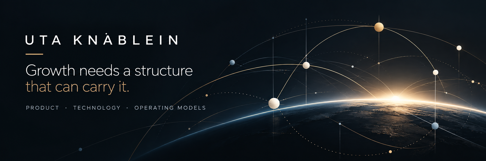

# Hi, I'm Uta 👋

I work on the structure underneath product: decision rights, what gets measured, who owns which call, and whether the data can be trusted enough to act on.

AI doesn't transform organizations. Redesigning the systems AI operates in does.

I've built the version that doesn't hold, the repaint that looks like a rebuild. That's where I learned to tell the difference. Machine learning in product since 2015: recommendation and personalization at consumer scale, and most recently a customer data platform built to feed agentic systems.

**What's in here**
- [engine-diagnostic](https://utaknablein.github.io/engine-diagnostic/) – a quick AI maturity check based on my ENGINE framework
- [product-operating-system](https://github.com/utaknablein/product-operating-system) – how I structure product work end to end
- [agent-workflows](https://github.com/utaknablein/agent-workflows) – experiments with agents doing real work, not demos
- [board-devils-advocate](https://github.com/utaknablein/board-devils-advocate) – an agent that argues against your board deck before the board does

**Background**
Former CPO at iHeartMedia and WW. Ran before that product experience at JPMorgan Chase, Nickelodeon, CNBC.com and Outbrain. Co-founder of [ZeroFHE](http://www.zerofhe.ai), licensing fully homomorphic encryption IP.

Happy to compare notes on agents, FHE, or who owns the call when an agent makes it. 🙂
